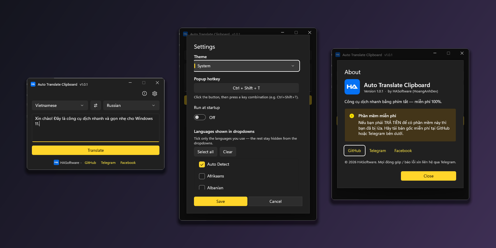

# Auto Translate Clipboard

A lightweight Windows 11 translation tool. Press a global hotkey anywhere, type or paste your text, press Enter, and the translation is copied to your clipboard instantly. The window then hides itself so you can paste the result wherever you were working.

Built with WinUI 3 (Windows App SDK) for a native Fluent look that follows your system light or dark theme.

  

## Features

- Global hotkey to summon the window from any application (default: Ctrl + Shift + T).
- Fast workflow: press Enter to translate, copy to clipboard, and hide the window in one step. Then paste with Ctrl + V anywhere.
- Press the hotkey again, or Esc, to hide the window without translating.
- Multi line input. Use Shift + Enter to add a new line; Enter alone translates.
- Over one hundred languages, with automatic source language detection.
- Settings to choose your theme (System, Light, Dark), change the hotkey, and pick exactly which languages appear in the dropdowns so the list stays short.
- Runs in the system tray and can start automatically with Windows.
- Native Fluent interface with Mica background and rounded corners.

## How it works

The app sends the text to Google Translate's public endpoint and reads the result as JSON, so multi line text and Unicode are handled correctly. The translation is always placed on the clipboard, ready to paste.

## Installation

No installation is required. The app is fully self contained.

1. Download the latest release archive.
2. Extract it to any folder.
3. Run AutoTranslate.exe.

Requires Windows 10 or Windows 11, 64 bit. The .NET runtime and Windows App Runtime are bundled, so nothing else needs to be installed.

## Usage

1. Open Settings and set a hotkey if you want to change the default.
2. Press the hotkey anywhere to open the window.
3. Type or paste your text and press Enter.
4. The window hides and the translation is copied to the clipboard. Press Ctrl + V to paste it.

Shift + Enter inserts a new line instead of translating. Esc hides the window. Closing the window with the X button also hides it to the tray rather than quitting. To quit completely, right click the tray icon and choose Exit.

## Settings

Open Settings from the gear button in the top right corner.

- Theme: follow the system theme, or force Light or Dark.
- Popup hotkey: click the button and press the key combination you want.
- Run at startup: launch the app automatically when Windows starts.
- Languages shown in dropdowns: tick only the languages you use. The rest are hidden from the source and target dropdowns.

## Build from source

Requirements:

- .NET 8 SDK or newer.
- Windows 10 or 11, 64 bit.

Build and run during development:

    dotnet build AutoTranslateWinUI.csproj -p:Platform=x64 -r win-x64

Create a self contained release build:

    dotnet publish AutoTranslateWinUI.csproj -c Release -r win-x64 -p:Platform=x64 --self-contained true -o dist\AutoTranslate

The project is unpackaged WinUI 3 and builds with the dotnet CLI; no Visual Studio workload is required.

## Project structure

- MainWindow: the translation window, tray icon, global hotkey, and clipboard workflow.
- SettingsDialog: theme, hotkey capture, run at startup, and the language picker.
- AboutDialog: app information and links.
- Services: translation, language list, settings persistence, global hotkey, and startup registration.

## Contributing

Contributions are welcome! Please read the [Contributing Guide](CONTRIBUTING.md)
before opening an issue or pull request. All participants are expected to
follow the [Code of Conduct](CODE_OF_CONDUCT.md).

Found a security issue? Please report it privately — see the
[Security Policy](SECURITY.md).

## License

This project is licensed under the [MIT License](LICENSE).

## Free software

Auto Translate Clipboard is one hundred percent free. If you were asked to pay for it, you were scammed. Always download the original from the links below.

## Author

Made by HASoftware (HoangAnhDev).

- GitHub: https://github.com/hasoftware
- Telegram: https://t.me/hoanganhdev
- Facebook: https://www.facebook.com/NTTU1502
